# Step Counter

An iPhone app that reads your daily step count from Apple Health and shows it in Home Screen and Lock Screen widgets. Built with SwiftUI, WidgetKit and HealthKit, with no third-party dependencies.

  

<p>
  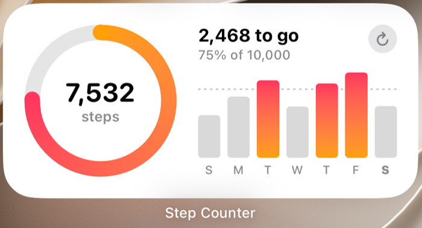
</p>

<table>
  <tr>
    <td>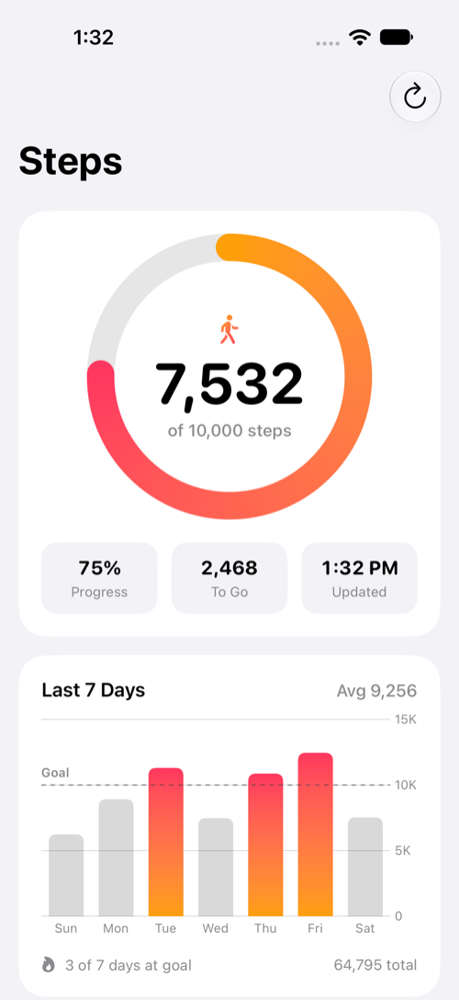</td>
    <td>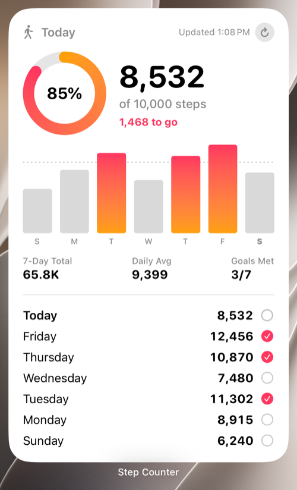</td>
    <td>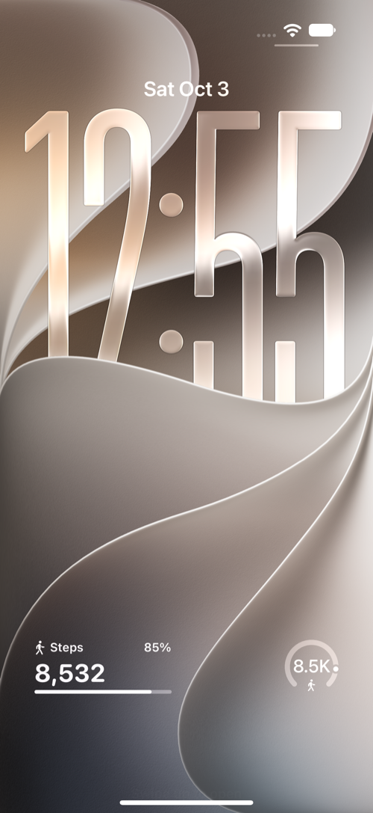</td>
  </tr>
  <tr>
    <td align="center">The app</td>
    <td align="center">Extra Large Portrait widget (iOS 27)</td>
    <td align="center">Lock Screen widgets</td>
  </tr>
</table>

## Features

- **App:** today's steps in a progress ring, the last 7 days as a chart, and a daily goal you can change.
- **Home Screen widget** in small, medium and large sizes, plus Extra Large Portrait on iOS 27.
- **Five color themes:** Classic, Sunset, Ocean, Forest and Midnight. Each widget can have its own.
- **Refresh button** on the medium and larger widgets.
- **Lock Screen widgets:** a circular gauge, a rectangular card, and a line of text above the clock.
- **Works everywhere widgets do:** StandBy, CarPlay, dark mode, and the tinted and clear Home Screen styles.
- **Matches the Health app:** iPhone and Apple Watch steps are combined without double counting.
- **Private:** no account, no analytics, no network access. Your data stays on your device.

<table>
  <tr>
    <td valign="top">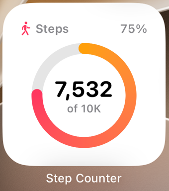</td>
    <td valign="top">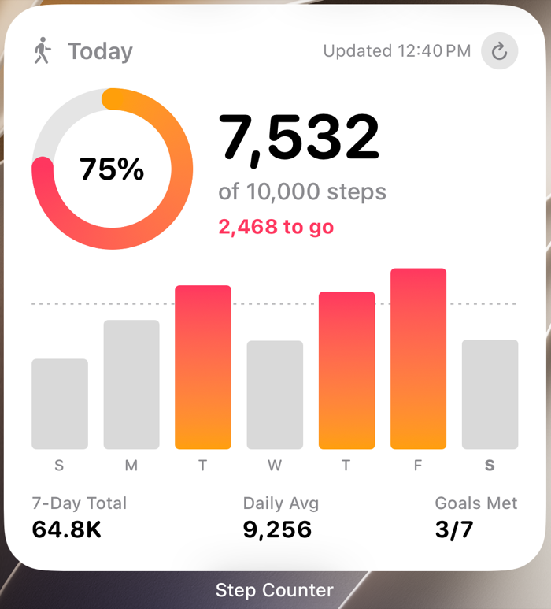</td>
    <td valign="top">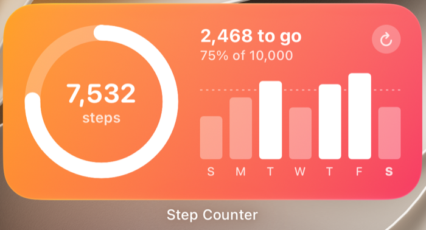</td>
  </tr>
  <tr>
    <td align="center">Small</td>
    <td align="center">Large</td>
    <td align="center">Sunset theme</td>
  </tr>
</table>

## Requirements

- A Mac with **Xcode 27 or later**. The project uses iOS 26 and iOS 27 APIs, which need the iOS 27 SDK.
- An iPhone or iPad running **iOS 17 or later**.
- An **Apple ID**. A free one works; see [Free or paid Apple ID](#free-or-paid-apple-id).

## Install it on your iPhone

### 1. Get the code

```sh
git clone https://github.com/AhmadBukhari8966/step-counter-widget.git
cd step-counter-widget
```

Or click **Code › Download ZIP** on GitHub and unzip it.

### 2. Use your own app identifiers

Bundle identifiers and App Groups must be unique across every Apple developer, so replace the ones in this project with yours. In Terminal, from the project folder:

```sh
./scripts/configure.sh com.yourname
```

Use any reverse-DNS prefix, such as `com.janedoe`. The script updates the app, the widget, and the App Group they share.

If you know your 10-character Team ID, add it as a second argument (`./scripts/configure.sh com.janedoe ABCDE12345`) and you can skip choosing a team in step 3. Paid members can find it at [developer.apple.com/account](https://developer.apple.com/account) under Membership details.

<details>
<summary>Prefer to change the identifiers by hand?</summary>

Replace the prefix in these places:

1. **Bundle Identifier** of both targets in Xcode (Signing & Capabilities). The widget's must start with the app's, for example `com.janedoe.StepCounter` and `com.janedoe.StepCounter.Widget`.
2. **App Group** in both targets' Signing & Capabilities, for example `group.com.janedoe.StepCounter`. This edits `StepCounter/StepCounter.entitlements` and `StepCounterWidget/StepCounterWidget.entitlements`.
3. **`AppGroup.identifier`** in `Shared/AppGroup.swift`, set to the same App Group.

</details>

### 3. Sign in and choose your team in Xcode

1. Open `StepCounter.xcodeproj`.
2. Go to **Xcode › Settings › Accounts**, click **+**, choose **Apple ID**, and sign in.
3. In the left sidebar, click the blue **StepCounter** project at the top. If the sidebar shows something else, press ⌘1.
4. Under **Targets**, select **StepCounter**, open **Signing & Capabilities**, and set **Team** to your name or organization. If you don't see the Targets list, click the sidebar button at the top-left of the editor.
5. Do the same for **StepCounterWidgetExtension**.

Xcode saves your team in the project file. To keep it out of your commits, put it in `Config/Signing.local.xcconfig` instead, which Git ignores. `configure.sh` writes that file when you give it a Team ID.

### 4. Run it on your iPhone

1. Connect your iPhone with a cable, unlock it, and tap **Trust**.
2. At the top of the Xcode window, click the device name and choose your iPhone.
3. Press **▶ Run** (⌘R). The first run can take a few minutes while Xcode prepares the phone.
4. If your iPhone asks for **Developer Mode**, turn it on in Settings › Privacy & Security › Developer Mode. The phone restarts; confirm, then press Run again.
5. **Free Apple ID only:** if the app won't open, go to Settings › General › VPN & Device Management, tap your Apple ID, and tap **Trust**. Then open Step Counter from the Home Screen.

Use **Run**, not **Build**. Build only compiles; Run installs the app and opens it. After the first cable connection, Xcode can usually install over Wi-Fi when your Mac and iPhone are on the same network.

### 5. Connect Apple Health

Open Step Counter, tap **Connect Apple Health**, turn on **Steps**, and tap **Allow**. On iOS 27, Health also asks how much history to share. Either choice works, because the app reads only the last 7 days.

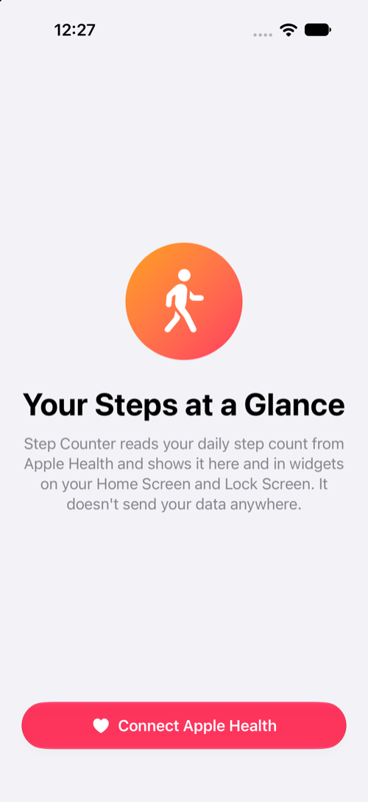

## Add the widgets

- **Home Screen:** touch and hold an empty spot, tap **Edit › Add Widget**, search for "Step Counter", pick a size, and tap **Add Widget**. On iOS 18 and later you can also touch and hold the Step Counter icon and pick a widget size from the top of its menu.
- **Lock Screen:** touch and hold the Lock Screen, tap **Customize › Lock Screen**, tap the widget area, and choose Step Counter.
- **Change a widget's colors:** touch and hold it, choose **Edit Widget**, and pick a **Theme**.
- **Refresh:** tap **↻** on a medium or larger widget, or open the app.

<table>
  <tr>
    <td valign="top" align="center">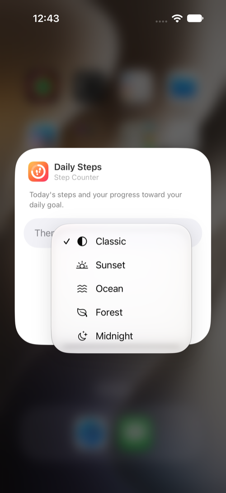<br>Theme picker</td>
    <td valign="top" align="center">
      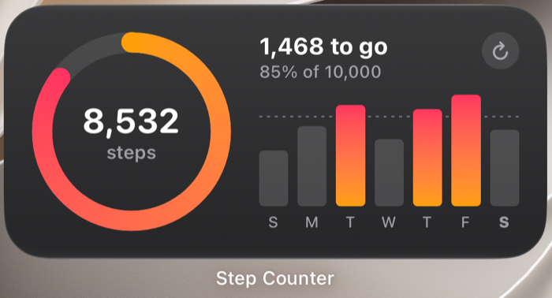<br>Dark mode<br><br>
      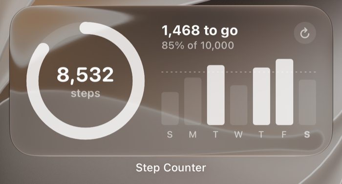<br>Clear Home Screen style (iOS 26+)
    </td>
  </tr>
</table>

## Free or paid Apple ID

| | Free Apple ID | Apple Developer Program ($99/year) |
| --- | --- | --- |
| Install on your own iPhone | Yes | Yes |
| How long an install lasts | 7 days | 1 year |
| TestFlight and the App Store | No | Yes |

With a free Apple ID the app stops opening after 7 days. To renew it, connect your iPhone and press **Run** in Xcode again. That reinstalls over the old copy, so your Health permission, goal and widgets stay.

## How it works

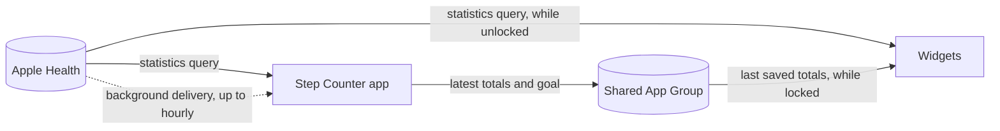

- **Reading steps:** a HealthKit statistics collection query sums the last 7 days. HealthKit merges iPhone and Apple Watch samples the same way the Health app does, so the totals match.
- **Sharing with the widget:** the app and widget extension share an App Group, which holds the latest daily totals and the goal.
- **While the iPhone is locked:** iOS encrypts Health data, so the widget can't read it then. It shows the last totals the app or widget saved instead.
- **Refreshing:** the widget asks for a new timeline about every 15 minutes, as often as iOS allows. It also schedules a reset to 0 at midnight.
- **In the background:** the app registers a HealthKit observer with background delivery. iOS wakes it when new steps are recorded (at most hourly for steps), and it reloads the widgets only if the numbers changed, to save the widgets' refresh budget.
- **Interactive pieces:** the refresh button and the theme option are App Intents.

## Project structure

| Path | What's in it |
| --- | --- |
| `StepCounter/` | The app: SwiftUI screens, the view model, and HealthKit background updates |
| `StepCounterWidget/` | The widget extension: timeline provider, widget layouts, and App Intents |
| `Shared/` | Built into both targets: HealthKit queries, the shared cache and goal, themes, and the ring and bar chart views |
| `Config/` | Signing settings. Your Team ID goes in `Signing.local.xcconfig`. |
| `scripts/configure.sh` | Switches the bundle IDs, App Group and team to yours |

The folders are synchronized with Xcode, so new files you add there are picked up automatically.

## Development

- **Previews:** open `StepCounterWidget/StepsWidget.swift` and show the canvas to see every widget size with sample data.
- **Simulator:** the iOS Simulator has Apple Health, but it starts with no steps. Open the Health app in the Simulator, find **Steps**, and add some data.
- **Debugging the widget:** run the **StepCounterWidgetExtension** scheme to launch the widget directly on the Simulator's Home Screen.
- **Code style:** Swift 6 language mode with strict concurrency. Please keep builds free of warnings.
- **Widget fonts:** in widgets, set fonts as `.system(.title2, design: .rounded).weight(.bold)`. On iOS 27, widgets drop the weight and design you pass to `.system(_:design:weight:)`. `Font.rounded(_:)` in `Shared/StepTheme.swift` does this for you.

## Troubleshooting

| Problem | Fix |
| --- | --- |
| "Signing for StepCounter requires a development team" | Choose your team for both targets ([step 3](#3-sign-in-and-choose-your-team-in-xcode)). |
| "Failed to register bundle identifier" or the App Group isn't available | Someone else already uses that identifier. Run `./scripts/configure.sh` with a different prefix. |
| The app won't open after installing | Trust your developer profile ([step 4](#4-run-it-on-your-iphone)). With a free Apple ID, 7 days may have passed; press Run again. |
| The app shows 0 steps | Make sure Steps is allowed in Settings › Privacy & Security › Health › Step Counter, and that Fitness Tracking is on in Settings › Privacy & Security › Motion & Fitness. |
| The widget isn't up to date | iOS limits how often widgets refresh. Open the app or tap ↻. While the phone is locked, the widget shows the last saved count. |

## Privacy

Step Counter only reads your step count. It doesn't write to Health, doesn't use the network, and doesn't collect analytics. Totals are stored in the App Group on your device so the widget can show them. Both targets include a privacy manifest (`PrivacyInfo.xcprivacy`).

## Contributing

Issues and pull requests are welcome. For a pull request, please describe what you changed and how you tested it, and make sure the project builds without warnings.

## License

Step Counter is released under the [MIT License](LICENSE).
