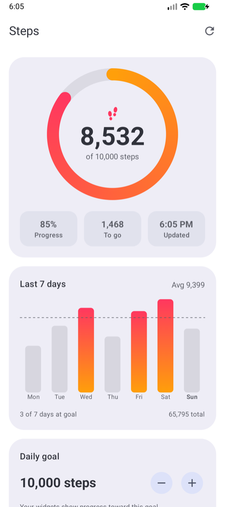
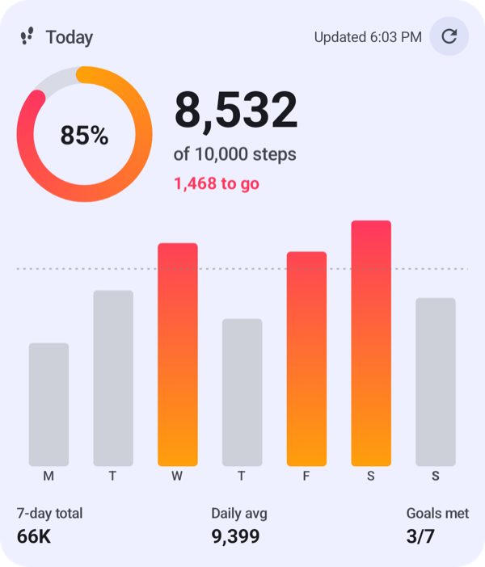
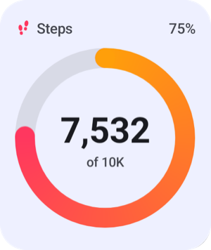
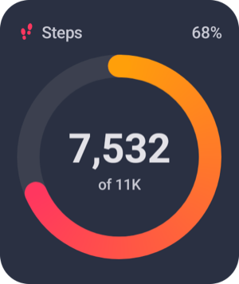
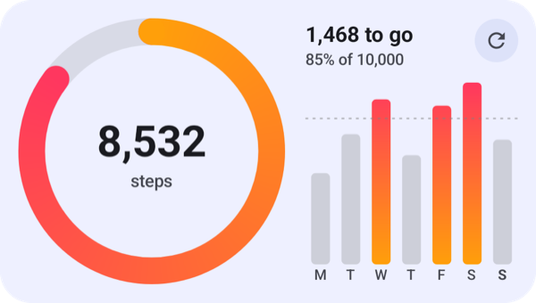
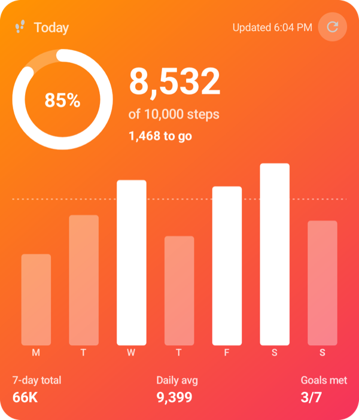
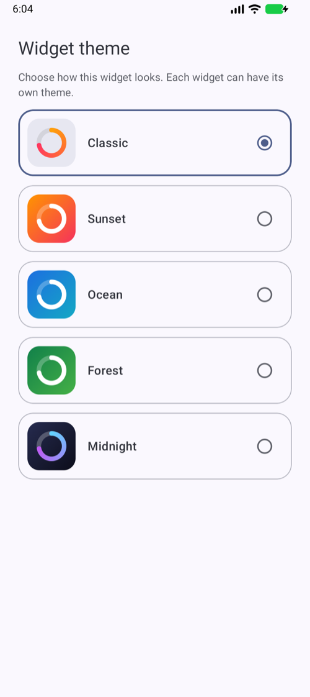

# Step Counter for Android

The Android version of Step Counter: an app and a Home Screen widget that show your daily steps from Health Connect, Android's shared store for health data. Built with Kotlin, Jetpack Compose and Jetpack Glance.

<table>
  <tr>
    <td></td>
    <td valign="top">
      <br><br>
      
      
    </td>
  </tr>
</table>

## Features

- **App:** today's steps in a progress ring, the last 7 days as a chart, and a daily goal you can change.
- **Home Screen widget** that adapts to its size: small (2×2), medium (4×2) and large (4×4).
- **Five color themes:** Classic (follows your wallpaper's Material You colors), Sunset, Ocean, Forest and Midnight. Each widget can have its own.
- **Refresh button** on the medium and large widget.
- **Dark mode** in the app and the widget.
- **Matches Health Connect:** steps from your phone, a watch and fitness apps are combined without double counting.
- **Private:** no account, no analytics, no network access.

<table>
  <tr>
    <td></td>
    <td></td>
    <td></td>
  </tr>
</table>

## Requirements

- A phone running **Android 9 or later**.
- **Health Connect.** It's built into Android 14 and later. On Android 9 to 13, the app sends you to Google Play to install it.
- **Something that records steps into Health Connect**, such as your phone's own step tracking, Google Fit, Fitbit or Samsung Health.
- To build it yourself: **Android Studio 2026.1 or later**.

## Install it on your phone

### Option 1: Install the APK (no computer needed)

Android lets you install apps from outside the Play Store, and there's no 7-day limit like on iPhone.

1. On your phone, open this link to download the app: **[StepCounter.apk](https://github.com/AhmadBukhari8966/step-counter-widget/releases/latest/download/StepCounter.apk)**. It's also on the [Releases](https://github.com/AhmadBukhari8966/step-counter-widget/releases) page.
2. Open the downloaded file. If Android asks, allow your browser or Files app to install unknown apps.
3. Tap **Install**, then **Open**. If Google Play Protect warns that it doesn't recognize the developer, tap **More details › Install anyway**.

To update later, download the newest APK and install it over the old one. Your data and widgets stay.

### Option 2: Build it with Android Studio

1. Install [Android Studio](https://developer.android.com/studio).
2. Choose **File › Open** and select the `android` folder of this repository. Wait for Gradle to finish syncing.
3. On your phone, turn on USB debugging. Go to Settings › About phone and tap **Build number** seven times, then go to Settings › System › Developer options and turn on **USB debugging**.
4. Connect the phone with a cable and tap **Allow** when it asks about USB debugging.
5. Choose your phone in the device menu at the top of Android Studio and click **Run ▶**.

To build an APK to share, run this in the `android` folder:

```sh
./gradlew assembleRelease
```

The file is `app/build/outputs/apk/release/app-release.apk`.

### Signing your own builds

Android only installs an update if it's signed with the same key as the version already on the phone. Release builds use your own key when you add one to `~/.gradle/gradle.properties`, outside the repository:

```properties
stepcounter.keystore=/path/to/your-release.jks
stepcounter.keystorePassword=your-password
stepcounter.keyAlias=your-key-alias
```

Create the key with Android Studio (**Build › Generate Signed App Bundle or APK › Create new**) or with `keytool`. Without one, release builds are signed with Android Studio's debug key, which is fine for testing. Back up the key file and its password: if you lose them, people have to uninstall the app before they can install your next version.

## Connect Health Connect

1. Open Step Counter and tap **Connect Health Connect**.
2. Tap **Allow all**, then **Allow**, so the app can read your steps.
3. Health Connect then asks whether Step Counter can **access data in the background**. Tap **Allow** so the widget can refresh while the app is closed. If you skip this, the widget still works but only updates when you open the app.

## Add the widget

- **From the app:** scroll down and tap **Add to Home Screen**.
- **From the Home Screen:** touch and hold an empty spot, tap **Widgets**, and find **Step Counter**.
- **Resize it:** touch and hold the widget and drag its edges. It switches between the small, medium and large layouts as it grows.
- **Change its colors:** touch and hold the widget, tap **Settings**, and pick a theme.

## How it works

- **Reading steps:** Health Connect's aggregation adds up the last 7 days per day. It follows the priority order in Health Connect's settings, so steps from a phone and a watch aren't counted twice.
- **Sharing with the widget:** the app and widget save the latest totals and your goal on the phone, so the widget always has something to show.
- **Refreshing:** a background job asks to run every 15 minutes. Android decides when it actually runs and can hold it back for an hour or more to save battery. Each run reads Health Connect (if you've allowed background access) and redraws the widget, which also resets it to 0 after midnight. Opening the app or tapping ↻ always refreshes right away.
- **Drawing:** widgets can't draw shapes, so the ring and the bar chart are drawn into images at the widget's exact size.

## Project structure

| Path | What's in it |
| --- | --- |
| `app/src/main/java/.../data/` | Health Connect queries, the step snapshot, and saved totals and goal |
| `app/src/main/java/.../ui/` | The app's screens, ring and chart |
| `app/src/main/java/.../widget/` | The widget's layouts, themes, theme picker, refresh button and background job |
| `app/src/debug/` | A debug-only helper that loads sample steps (see below) |

## Testing on an emulator

An emulator running Android 14 or later has Health Connect but no steps. Debug builds include a helper that loads the same sample week used in testing:

```sh
adb shell pm grant com.ahmadbukhari.stepcounter android.permission.health.WRITE_STEPS
adb shell am broadcast -n com.ahmadbukhari.stepcounter/.debug.SeedStepsReceiver -f 32
# Add 1,000 steps right now:
adb shell am broadcast -n com.ahmadbukhari.stepcounter/.debug.SeedStepsReceiver -f 32 --ei add 1000
```

## Troubleshooting

| Problem | Fix |
| --- | --- |
| The app shows 0 steps | Open Health Connect › Data and access › Steps and check that steps are recorded there. Under **Data sources and priority**, make sure the app that records your steps is listed. |
| The widget only updates when you open the app | Allow background access: Health Connect › App permissions › Step Counter › **Access data in the background**. |
| "Get Health Connect" appears | You're on Android 13 or earlier. Install Health Connect from Google Play, then open Step Counter again. |
| The widget picker doesn't show Step Counter | Open the app once after installing it. |

## Privacy

Step Counter only reads your step count. It doesn't write to Health Connect, doesn't use the internet and doesn't collect analytics. Daily totals are stored on your phone so the widget can show them, and they're deleted when you uninstall the app. Health Connect shows the app's privacy explanation from its permission screen.
